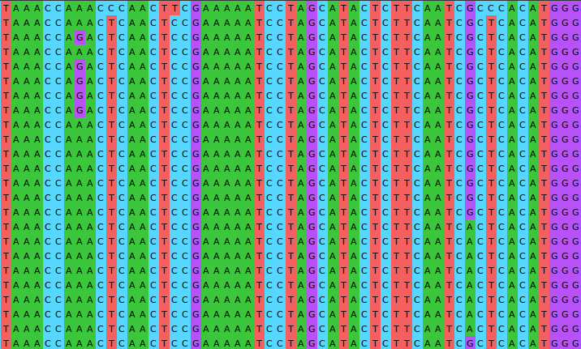

```{r setup, include = FALSE}
library(tidyverse)
library(gganimate)
library(RColorBrewer)
library(knitr)
library(ape)
```

<!-- adding bold and italic options -->
<style>
em {
  font-style: italic
}
strong {
  font-weight: bold;
}
</style>

## Ancient DNA lectures in living systems

- Phylogeny and tree of life
- Fossils and the fossil record
- DNA
- DNA sequences (phage genomes)
- Mitochondria

```{r, out.width = "45%", dpi = 300, echo = FALSE, fig.align='right'}
include_graphics("./assets/img/smilodon1.png")
```

--- .class #id

## Paijmans et al. 2017

```{r, out.width = "100%", out.height=500, dpi = 300, echo = FALSE}
include_graphics("./assets/img/Paijmans et al. - 2017.pdf")
```

--- .class #id

## Molecular phylogenetics

- What is a phylogeny and how do we calculate them?
- Genetics, mutation and inheritance
- The mitochondrial genome

--- &twocol bg:white

## You already seen diagrams like this...

### This is called a `phylogeny`. It represents the evolutionary process

*** =right

```{r, out.width = "80%", fig.width = 3, fig.height = 3, dpi = 600, fig.align = "center", echo = FALSE}

my.tree1 <- read.tree(text="((((human,chimp),(cat,dog)),(snake,lizard)),fish);")
par(mar=c(1,1,1,1))
plot(my.tree1)
```

*** =left

- The phylogeny works like an evolutionary tree
- The tips are species
- The branches show their relationships
- Nodes represents common ancestors, from which new species evolved
- Generally, phylogenies are calculated using **genetic data**

--- .segue .dark 

## How does that work?

--- .class bg:white

```{r, out.width = "95%", dpi = 300, echo = FALSE, fig.align='center'}
include_graphics("./assets/img/mtDNA_tree.svg")
```

--- .class #id

## Inheritance plus mutation

- Errors in DNA replication (mutations) change the DNA sequence
- Human mutation rate is ~1.1×10−8 mutations per site per generation
- This means you carry ~40 mutations in your 3.6 Gb genome
- These differences are inherited by offspring
- Sequence divergence and time are (approximately) linearly related

### Phylogenetics works in reverse: we observe the DNA sequences and try to work out the tree that generated them

--- .class #id

## DNA sequence alignment

```{r, out.width = "90%", dpi = 300, echo = FALSE, fig.align='center'}

```

--- .class #id

## Mitochondrial DNA is great for phylogenetics!

```{r, out.width = "70%", dpi = 300, echo = FALSE, fig.align='center'}
include_graphics("./assets/img/Mitochondrion_mini.svg")
```

--- &twocol

## Mitochondrial DNA is great for phylogenetics!

*** =right

```{r, out.width = "100%", dpi = 300, echo = FALSE, fig.align='center'}
include_graphics("./assets/img/Map_of_the_human_mitochondrial_genome.svg")
```

*Emmanuel Douzery, CC BY-SA 4.0*

*** =left

- Mitochondrial genome ~16 kb
- 13 protein-coding genes, 2 rRNAs and 22 tRNAs
- High mutation rate
- No recombination
- High copy number per cell

--- &thankyou

## Next time

**The study of ancient DNA**
